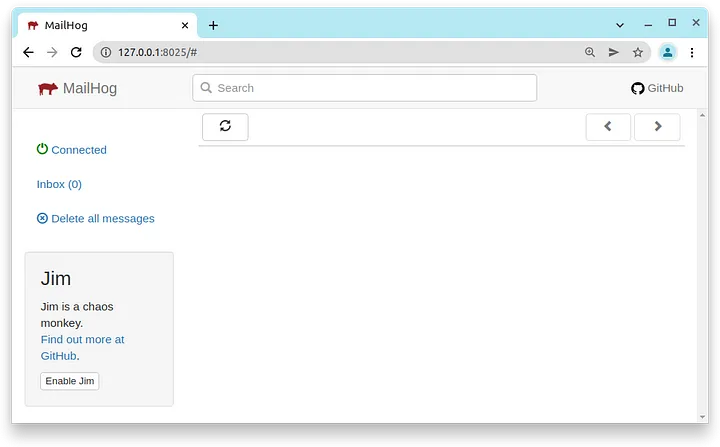
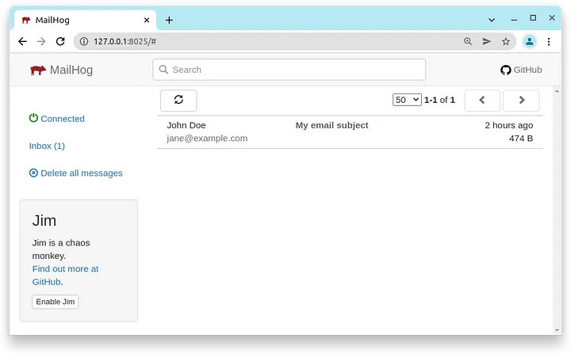
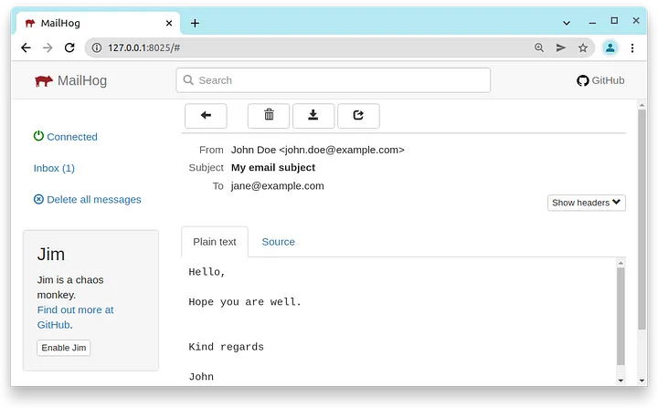
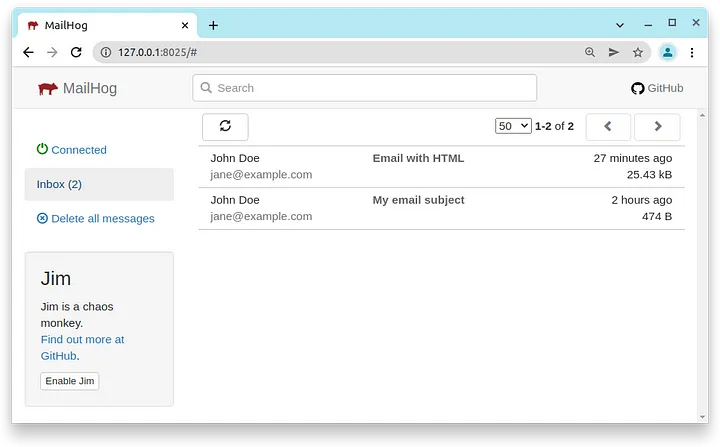
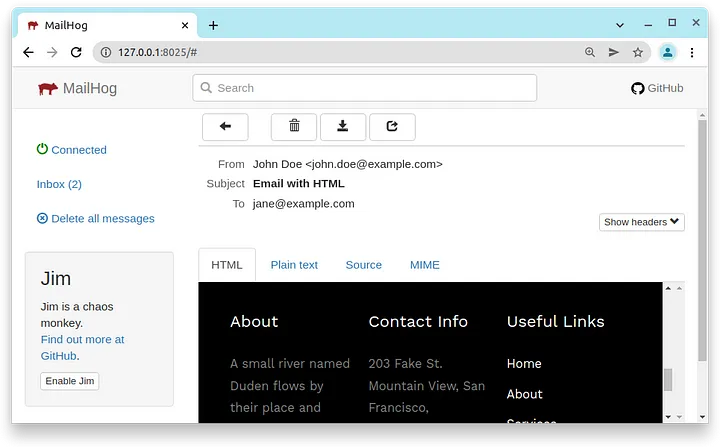
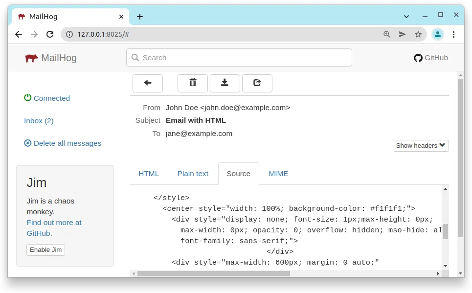

MailHog
=======

Using Mailhog one can very easily have a free personal SMTP server to test code with. Set it up with just one command.

To properly test the email functionality of the webservice we need a SMTP server to make sure the mails sent out are
correct and in order. It would be embarrassing and unprofessional if the software, due to possibly being insufficiently
tested, accidentally sent out emails to say the wrong users or send out emails with incorrect content. It would be best
if we have a SMTP simulator with which we could do testing with.

An ideal SMTP test server should meet the following requirements:

- Be able to be run locally on a development machine.
- Have no limit on how many message could be sent to it. This is because some SMTP services have limits on how many
  mails could be sent out at any given time.
- Have an UI to view the emails received. It would also be a bonus if the HTML and CSS in the mail is rendered for me to
  simulate an email client like Thunderbird.
- Be easy to set up.
- Could be run as a Docker container for automated integration testing

[Mailhog] meets all the requirements above.

### Setting up MailHog

To make a MailHog docker container type the following command:

```console
docker run -d -p 1025:1025 -p 8025:8025  --name mailhog-container jack20191124/mailhog:latest
```

This command will download the MailHog image, make the container and then run it in the background ready for use. Port
`1025` is exposed for the SMTP server port and port `` for the MailHog Web UI. After the container is up and running
we can then navigate to the Web UI using URL http://127.0.0.1:8025.



Now use these server parameters for email client:

```console
SMTP hostname:                        localhost
SMTP port:                            1025
SMTP username:                        anything
SMTP password:                        anything
SMTP use encryption like SSL or TLS:  False
SMTP authentication method:           Password
```

We can now set up our email client with the SMTP parameters above and test it. For instance here's a plain text email
shown in the UI:




When we send an email with embedded HTML and CSS we can see the rendered view and the source which is very convenient
for testing:





[Mailhog] is an excellent tool to use and will make your life a lot easier when doing SMTP testing.

[Mailhog]: https://mailhog.qubitpi.org/
